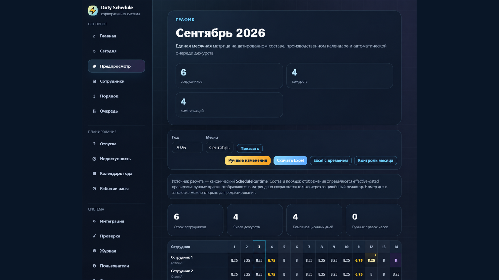
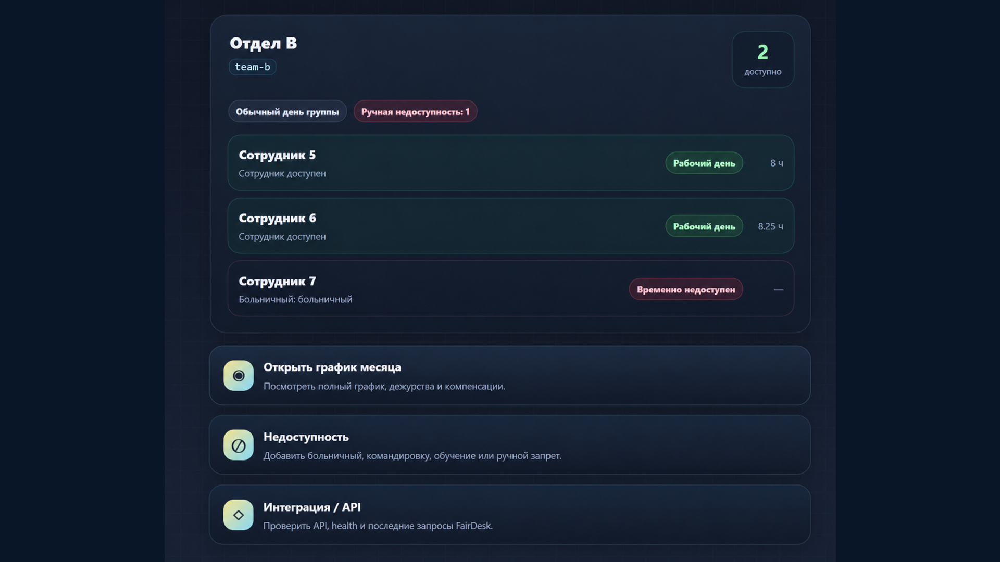

# Duty Schedule — графики дежурств и доступность сотрудников

**Внутренняя веб-система для планирования рабочего времени, дежурств и определения доступности сотрудников.**

**Последний выпущенный релиз:** 2.0.4 (сентябрь 2026)  
**Статус:** действующая каноническая V2-система с принятыми последующими улучшениями  
**Исходный код:** закрыт  
**Публикация:** обезличенный кейс о продукте, архитектуре и результатах

## Задача проекта

Рабочий график — это не просто таблица рабочих дней. Сотрудники приходят, меняют группы, меняют рабочий режим, временно отсутствуют или возвращаются после перерыва. Дежурства влияют на очередность и компенсационные дни, а другие внутренние системы должны понимать, можно ли назначить сотруднику новую задачу.

При ручном подходе возникают типичные проблемы: изменение будущего состава влияет на старые месяцы, очередь дежурств путается с порядком строк, а Excel и оперативная информация расходятся между собой.

**Duty Schedule объединяет эти правила в одной системе:** администратор управляет исходными данными и исключениями, а месячный график, оперативная панель, контроль месяца, Excel и API получают результат из общей расчётной модели.

## Для кого и для чего

| Пользователь или модуль | Что получает |
| --- | --- |
| Администратор | Управление сотрудниками, календарём, очередями, корректировками и ограничениями |
| Сотрудник с доступом | Просмотр графика и доступной ему информации |
| Ответственный за график | Контроль месячного результата и подготовку Excel |
| Система обработки заявок | Готовое состояние доступности без повторного расчёта календарных правил |

Это система для конкретного внутреннего рабочего процесса, а не общедоступный облачный сервис.

---

## Основные возможности

### Сотрудники и история изменений

- Создание сотрудников через интерфейс без ручной правки базы.
- Изменение группы, отображаемого имени и продолжительности рабочего дня **с указанной даты**.
- Независимое включение и исключение из автоматической очереди дежурств.
- Завершение периода работы без удаления прошлых назначений.
- Возвращение сотрудника после перерыва с сохранением устойчивой идентичности и истории.
- Проверка будущих изменений на совместимость с уже существующим графиком.

**Принцип:** изменение, действующее с определённой даты, не должно переписывать предыдущие месяцы.

### Производственный календарь и недоступность

- Рабочие, выходные и праздничные дни.
- Режимы и продолжительность рабочего времени.
- Отпуска, больничные, обучение и другие ограничения доступности.
- Единые правила отображения специальных состояний в графике и Excel.
- Проверка полноты календарных данных перед построением результата.
- Защита от случайной перезаписи изменённого календаря устаревшей формой.

### Очереди дежурств и компенсации

- Отдельная очередность для разных групп.
- История версий очереди: новый порядок действует с выбранной даты.
- Возможность явно задать следующего участника ротации.
- Учёт перевода, добавления и выбытия сотрудников.
- Ручные назначения без обязательного изменения автоматической последовательности.
- Расчёт компенсационных дней и их отражение в графике.
- Проверка противоречий между ручными часами, дежурствами, компенсацией и периодами назначения.
- Сохранение согласованности на границах месяцев и при будущих изменениях.

**Порядок отображения в таблице и порядок автоматического дежурства разделены.** Изменение вида графика не меняет ротацию.

### Рабочие экраны и ручные корректировки

- **Today** — оперативная картина рабочего дня и доступности сотрудников.
- **Preview** — месячная матрица рабочих часов, дежурств, компенсаций и других состояний.
- **Month Check** — контроль согласованности результатов за месяц.
- Редактирование ручных часов и дежурств через контролируемые формы.
- История изменений и проверки их допустимости.
- Отдельная работа с будущими периодами назначений и участия в дежурствах.

*Месячное представление показывает рассчитанные рабочие часы, дежурства и компенсационные состояния.*

*Оперативная витрина помогает увидеть доступность сотрудников и причины ограничений.*

На опубликованных изображениях используются демонстрационные, а не рабочие персональные данные.

### Динамический Excel

Система формирует XLSX по действующему составу на выбранный период:

- сотрудники не привязаны к заранее зафиксированному числу строк;
- учитываются исторические назначения и порядок отображения;
- доступны обычный график и вариант с данными о рабочем времени;
- сохраняются рабочие обозначения, структура и формат отчёта;
- изменение штата не требует вручную переписывать шаблон с именами;
- текстовые поля экспортируются безопасно, без интерпретации имён как формул.

---

## API и взаимодействие с FairDesk

**Duty Schedule — источник данных о календаре, дежурствах и доступности.** Для других внутренних систем предусмотрен защищённый API только для чтения.

Он предоставляет сведения о состоянии сервиса, календарном дне, дежурствах, статусе конкретного сотрудника и доступности для назначения задач.

Подтверждена интеграция с **FairDesk** — системой регистрации и распределения заявок:

- Duty Schedule рассчитывает график и готовую доступность;
- FairDesk управляет заявками, исполнителями и их нагрузкой;
- FairDesk учитывает полученный признак доступности при назначении;
- интеграция не даёт FairDesk права изменять расписание.

Таким образом, сложные календарные правила не копируются в код каждой соседней системы.

## Архитектура: почему версия 2.0 стала важной

Главная переработка — переход от единственного «текущего состояния сотрудника» к **изменениям с датами действия**. Отдельно моделируются личность сотрудника, периоды назначений, состав группы, ротация дежурств и порядок показа.

| Решение | Практический результат |
| --- | --- |
| Постоянная идентичность сотрудника | Переводы и возвращение не разрывают историю |
| Назначения с датами действия | Будущее изменение не искажает прошлые графики |
| Версионируемые очереди | Очередность корректна для разных периодов |
| Независимый display order | Внешний вид таблицы не вмешивается в ротацию |
| Единый расчётный runtime V2 | Today, Preview, Excel и API согласованы |
| Транзакционные изменения | Связанные операции не остаются выполненными наполовину |
| Контроль бизнес-инвариантов | Конфликты обнаруживаются до фиксации изменения |

### Пример рабочего сценария

Администратор заранее переводит сотрудника в другую группу. Система сохраняет новый период назначения, проверяет связанные правила дежурств и доступности, а затем рассчитывает график согласно дате перехода. В прежнем месяце остаётся прежний состав, в новом — актуальный.

Аналогичный подход используется при смене рабочего режима, завершении работы и возвращении сотрудника после перерыва.

---

## Дополнительные возможности

### Администрирование и персональные учётные записи

У системы есть отдельный контур управления пользователями, не привязанный к идентичности сотрудника в рабочем графике.

- Создание персональных административных учётных записей и управление их состоянием.
- Сброс паролей и безопасное изменение собственных учётных данных.
- Отзыв ранее выданных сессий после изменения учётных данных или статуса аккаунта.
- Предотвращение деактивации собственной административной учётной записи и потери последнего активного администратора.
- Фиксация административных действий с указанием инициатора без записи паролей в журнал.
- Согласованная обработка конкурирующих операций над одной учётной записью.

Это позволяет управлять доступом отдельно от кадрового состава, не вмешиваясь в историю рабочих назначений.

### Версии правил рабочего времени

Рабочее время описывается не одной изменяемой настройкой, а правилами, действующими в определённые периоды.

- Создание нового правила с будущей или текущей датой вступления в силу.
- Выбор версии правила, действовавшей на конкретную календарную дату.
- Завершение периода действия правила с сохранением предыдущих версий.
- Отмена ещё не вступивших в силу запланированных изменений.
- Проверка временных границ, чтобы правила не создавали противоречивое покрытие дат.
- Применение исторически корректного правила в месячном расчёте и Excel-экспорте.

Поэтому, если рабочий режим изменился сегодня, старый график воспроизводится по прежним правилам, а не по настройкам текущего дня.

### Сложная ротация и переход между месяцами

Автоматические дежурства рассчитываются с учётом того, что фактическая работа может отличаться от первоначальной очередности.

- Очередь сохраняет свою историю и отдельную точку продолжения ротации.
- Ручное дежурство по умолчанию не обязано менять автоматическую последовательность.
- При необходимости администратор явно определяет, должно ли исключение повлиять на продолжение очереди.
- Смена группы, временная недоступность и окончание работы учитываются с соответствующих дат.
- Переход в следующий месяц проверяется с учётом фактически выполненных дежурств и согласованного продолжения очереди.
- Компенсационные дни, ручные часы и назначения проверяются совместно, в том числе когда изменения вносятся в разном порядке или затрагивают соседние месяцы.

Важен не только правильный ответ на один день, но и сохранение последовательности будущих дежурств без незаметного изменения исторического графика.

### Защита от устаревших и конкурирующих изменений

Внутренняя система должна корректно работать и тогда, когда несколько администраторов открывают одну и ту же форму или меняют связанные данные почти одновременно.

Например, если производственный календарь изменился после открытия формы, сохранение её старой версии не должно перезаписать более свежие изменения. Для подобных операций используются проверка актуальности состояния, транзакции и защита связанных записей.

В операциях с сотрудниками и дежурствами дополнительно проверяются зависимости: изменение назначения не должно оставлять несовместимые ручные дежурства, а закрытие периода работы — нарушать историю и будущие расчёты.

При конфликте предпочтение отдаётся отказу от некорректного изменения, а не частичной записи, которую затем пришлось бы исправлять вручную.

### Эксплуатационная диагностика и контролируемые обновления

Помимо пользовательских возможностей, проект включает средства сопровождения:

- единый диагностический System Check для основных компонентов и инвариантов;
- запуск диагностических проверок с разграничением доступа и защитой от повторного конкурентного запуска;
- ограничение частоты попыток входа;
- проверяемые изменения структуры базы данных;
- регрессионные сценарии на искусственных данных без переноса рабочих записей;
- контроль истории технических событий и сроков хранения журналов;
- резервное копирование проекта и базы данных;
- отдельно проверенные процедуры восстановления и приёмки обновлений.

Релиз считается принятым после прохождения соответствующих проверок, а подготовленные изменения не объявляются внедрёнными до завершения их проверки.

---

## Безопасность и надёжность

В действующей линии продукта предусмотрены:

- роли и ограничения доступа;
- CSRF-защита изменяющих действий;
- контроль активных сессий и отзыв устаревших сессий после изменения учётных данных;
- проверки пользовательского ввода и допустимости операций;
- согласованные транзакции и защита исторических данных;
- аудит существенных изменений с атрибуцией действий;
- отсутствие паролей и других значений учётных данных в событиях аудита;
- отдельная авторизация API;
- контролируемое техническое журналирование и ограничение срока хранения журналов;
- безопасное представление пользовательских текстовых значений в Excel;
- резервное копирование и проверенные процедуры восстановления;
- проверки целостности структуры базы данных и миграций.

Это описание внедрённых механизмов, **не заявление об абсолютной защищённости или внешней сертификации**. Детали внутренних сетей, адреса, настройки, секреты и эксплуатационные материалы не публикуются.

## Как проверялся результат

Изменения проходят отдельные проверки логики, совместимости и безопасности до включения в рабочую систему.

Контроль охватывает:

- исторические периоды и изменения состава сотрудников;
- очереди, ручные назначения и границы месяцев;
- конфликты компенсации, ручных часов и недоступности;
- корректность расчёта и согласованность интерфейса, Excel и API;
- права доступа, сессии и учётные записи;
- целостность схемы и последовательность миграций;
- тесты на обезличенных данных;
- System Check и эксплуатационную приёмку;
- резервное копирование и восстановление.

**Последняя задокументированная проверка уже внедрённых изменений:** 249 успешных проверок, 0 предупреждений, 0 ошибок. Этот результат относится к принятому состоянию системы и не означает, что ещё не внедрённые изменения уже прошли приёмку.

## Эволюция проекта

| Этап | Результат |
| --- | --- |
| Первая система | Рабочий календарь и формирование графиков |
| 2.0 | Каноническая V2-модель, исторический состав, версии очередей, единый расчёт и динамический Excel |
| 2.0.1–2.0.3 | Эксплуатационные исправления и уточнение специальных состояний |
| **2.0.4** | Дополнительная целостность исторических данных, операций, учётных записей и Excel |
| После 2.0.4 | Принятые улучшения надёжности, безопасности сессий, проверок и технического журналирования |
| Дальнейшая работа | Отдельные изменения проходят review и приёмку до возможного внедрения |

Последний выпущенный номер версии — **2.0.4**. Подготовленные изменения в отдельных ветках не выдаются здесь за готовые production-функции.

## Технологии

**Backend и данные:** PHP, PDO, MariaDB/MySQL.  
**Интерфейс:** HTML, CSS, JavaScript, Bootstrap.  
**Экспорт:** PhpSpreadsheet, XLSX.  
**Эксплуатация и качество:** Linux, Git/GitHub, SQL-миграции, регрессионное тестирование, резервное копирование и восстановление.

## Моя роль

Постановка задач и бизнес-правил, описание рабочих процессов, проектирование пользовательских сценариев, принятие архитектурных решений, организация разработки, проверок, внедрения и документации.

AI-инструменты применяются для ускорения анализа и подготовки решений, но изменения проверяются по реальным сценариям и принимаются поэтапно.

## Граница публичной информации

Duty Schedule — **закрытая внутренняя система**. Публично представлены назначение, возможности, архитектурные подходы, обезличенный интерфейс и проверенные результаты.

Исходный код, реальные сотрудники и расписания, внутренняя конфигурация, адреса, ключи доступа и рабочая инфраструктура не раскрываются.
