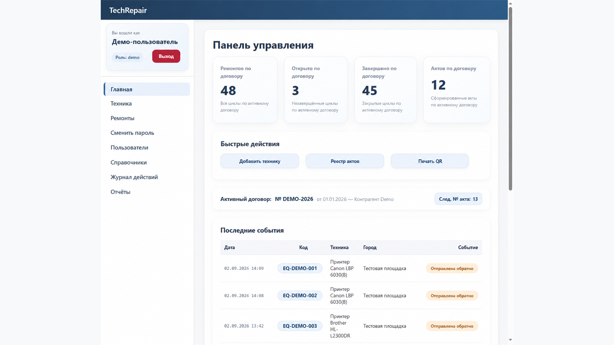
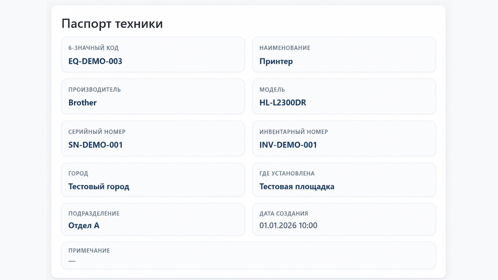

# TechRepair

### Система учёта оборудования, ремонтов и подменной техники

**TechRepair** — действующая внутренняя веб-система, которая объединяет сведения об оборудовании, его размещении, ремонтах, передаче и истории изменений. Она помогает вести жизненный цикл техники без разрозненных таблиц и потери контекста.

| Направление | Текущее состояние |
| :--- | :--- |
| **Продукт** | Работает во внутренней сети; не является публичным SaaS |
| **Основные функции** | Учёт техники, ремонты, QR, подменный фонд, договоры, акты и отчётность |
| **Установка и обслуживание** | Реализованы и проверены установка, восстановление и обновление для поддерживаемой среды |
| **Подготовка версии 1.0** | Исходники кандидата `1.0.0-rc.1` прошли полный инженерный CI; финальная приёмка дистрибутива и выпуск ещё впереди |
| **Исходный код** | Приватный; здесь — описание решений и обезличенные иллюстрации |

> **Принцип проекта:** данные о технике и её ремонтной истории должны оставаться достоверными даже после смены размещения, справочников, исполнителей и версий приложения.

---

## Для чего создана система

В рабочем процессе важно быстро ответить на несколько вопросов: **какая именно техника перед нами, где она находится, что с ней происходило и как оформлено её перемещение или ремонт**.

TechRepair связывает эти действия в одну последовательную историю. Заявки и назначение исполнителей остаются в отдельном модуле FairDesk: TechRepair отвечает именно за оборудование и подтверждённые операции с ним.

## Возможности

| Учёт и идентификация | Ремонты и документооборот |
| :--- | :--- |
| Карточки оборудования со стабильным кодом | История ремонтов и повторных ремонтных циклов |
| QR-идентификация устройства | Состояния ремонта и контроль переходов |
| Модели, типы, размещение и справочники | Договоры и акты передачи |
| Подменный фонд и операции выдачи | Отчёты, показатели и экспорт в XLSX |

Дополнительно реализованы пользователи и роли, журнал действий, контроль доступа и **read-only API v1** для ограниченных внутренних интеграций.

## Интерфейс

Система ориентирована на быстрые повседневные действия: поиск оборудования, проверку истории, оформление ремонта или выдачи подменного устройства.

| Панель управления | Карточка оборудования |
| :---: | :---: |
|  |  |
| Обзор состояния работ и быстрые операции | Код, идентификаторы, размещение и история устройства |

*Иллюстрации демонстрационные: идентификаторы и рабочие данные заменены. Отдельные элементы могут отличаться от актуальной версии интерфейса.*

## Что важно в реализации

### Надёжность бизнес-данных

- Ограничения целостности и уникальности на уровне БД, защита от дублей и конфликтующих операций.
- Исторические снимки значимых данных: изменение справочника позднее не должно переписывать уже оформленные события и документы.
- Контролируемые сценарии ремонтов, движения оборудования и подменного фонда.
- Проверка согласованности экранов, отчётов, актов и экспорта.

### Безопасность и эксплуатация

- Разделение ролей, проверка прав, защита изменяющих запросов, управление сессиями.
- Контролируемая обработка ошибок без вывода внутренних деталей пользователю.
- Действующая среда изолирована во внутренней сети; секреты и рабочие данные не публикуются.
- Миграции БД с предварительными проверками и сверкой результата, резервные копии и восстановление.

### Установка, восстановление и обновление

Поддерживаемая серверная среда — **Ubuntu Server 24.04 LTS**.

- **Чистая установка:** пакет с контрольными суммами → подготовка компонентов → настройка приложения → итоговая проверка.
- **Восстановление:** проверенная резервная копия → восстановление данных, вложений и QR → контроль целостности и работоспособности.
- **Обновление:** предварительные проверки и резервирование → контролируемое применение изменений → проверка результата и безопасное поведение при ошибках.
- **Windows Setup:** отдельная графическая оболочка, которая подключается к Linux-серверу и использует те же проверенные сценарии без дублирования серверной логики.

Эти сценарии прошли инженерные и изолированные испытания. **Кандидат `1.0.0-rc.1` ещё не является опубликованной стабильной версией**: отдельная релизная приёмка готового архива и выпуск остаются следующими шагами.

## Подход к качеству

Разработка ведётся небольшими проверяемыми изменениями. Типичный маршрут:

**Задача → ограниченный набор изменений → review → автоматические тесты → испытания на изолированной среде → контролируемое внедрение → проверка результата.**

Автоматические проверки охватывают работу с данными и миграциями, авторизованные HTTP-сценарии, установку, восстановление и обновление. Для повторяющихся CI-запусков используются безопасные правила переиспользования уже подтверждённых результатов: тяжёлые проверки не пропускаются, если доказательства не совпадают.

## Архитектура интеграций

| Модуль | Ответственность |
| :--- | :--- |
| **TechRepair** | Оборудование, размещение, ремонты, история и подменный фонд |
| **FairDesk** | Обращения, заявки, назначение и рабочий процесс |
| **Duty Schedule** | Дежурства и доступность сотрудников |

Интеграции строятся через ограниченные контракты. Для TechRepair текущая внешняя граница — **чтение данных**, а не произвольное изменение состояния сторонними приложениями.

## Технологии

`PHP 8.3` · `MariaDB` · `PDO` · `Nginx / PHP-FPM` · `JavaScript / HTML / CSS` · `Bootstrap` · `Python` · `GitHub Actions`

Используются также инструменты экспорта XLSX, генерации QR и shell-скрипты для проверяемых эксплуатационных операций.

## Моя работа над проектом

Постановка продуктовых задач, анализ реальных рабочих сценариев, проектирование структуры и правил, проверка реализации, организация тестов, релизов и документации. AI-инструменты помогают в разработке и review; решения принимаются по результатам проверки.

---

### Статус на октябрь 2026 года

**Рабочий внутренний продукт.** Основные сценарии реализованы и подтверждены проверками. В работе — финальная приёмка релиз-кандидата **`1.0.0-rc.1`**; стабильная **`1.0.0` ещё не опубликована**.

Этот публичный кейс не содержит исходный код, рабочие адреса, данные пользователей, внутренние настройки и конфиденциальные материалы.

[← Все кейсы](README.md) · [↑ Профиль DexHTML](../README.md)
